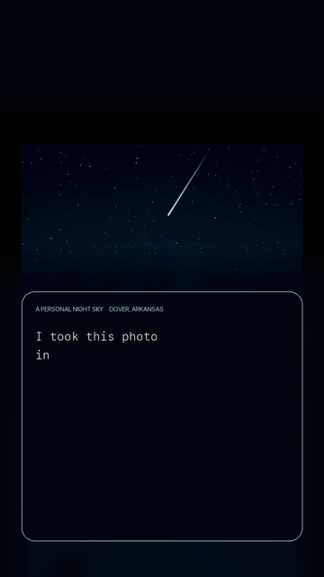

<p align="center">
  
</p>

<h1 align="center">TaaraNight</h1>
<p align="center"><em>One night. One constellation. One story.</em></p>

---

<p align="center">
  <a href="submission/taaranight-demo.mp4">
    
  </a>
</p>
<p align="center">
  <a href="submission/taaranight-demo.mp4"><strong>Watch the full 59-second TaaraNight trailer with sound</strong></a>
</p>

The logo above isn't stock art — it's a photograph I took of the night sky in Dover, Arkansas, one of the darkest corners of the state. Standing under that sky, I realized I could point at maybe two constellations with any confidence. Thousands of stars up there, and I knew almost none of their names.

**Taara** (తార) means *star* in Telugu, my mother tongue. TaaraNight is my attempt to fix that — one night at a time, for anyone on Reddit.

## What it is

Every night at dusk (6 PM Pacific), a new sky opens on the subreddit. Everyone gets the same one. You connect real stars — actual catalog positions, the same shapes you'd find over Dover — to reveal one of the 88 IAU constellations. When the last thread lands, the figure breathes, its name arrives — *Orion, The Hunter* — and a short original bedtime myth unlocks as your reward.

Then you go to sleep. Tomorrow there's a new sky.

It's a bedtime ritual, not a grind: the ambience is wind and crickets synthesized in your browser, the stories are short enough for young readers, and the whole community plays one shared board. The calendar sets the texture of the night: Monday is gentle, Sunday is dense, and every run has a soft timer.

## How to play

1. Open tonight's TaaraNight post and tap **Play**.
2. Drag star to star (one long stroke works too) to weave the constellation's threads. Wrong pairs shake gently; Glitches shimmer cold.
3. Stuck? use a **Whisper** — a hint that lights one missing thread, then cools down before it can be used again.
4. Reveal the figure, learn its name (turn on **star names** to learn each star's, too), and read its story.
5. Keep your **Jwala** — streak, from the Telugu for *flame* — burning by coming back each night.

## The sky you keep

Every constellation you reveal takes its true place in **My Sky** — a pannable, zoomable chart of the whole celestial sphere, drawn north-up like a real star atlas. Fill in all 88 and you've collected the entire sky — and along the way you've quietly learned to read the real one.

Solved a good night? Share it with a spoiler-safe card that shows your time, Glitches, Whispers, and streak, but never the constellation's name or shape. Nobody's night gets ruined.

There's one leaderboard per night: fastest time first, with quiet honesty tags for runs that used no Whispers or touched no Glitches. It resets at dusk. Streaks are the long game.

## Under the hood

- **Reddit Devvit** web app, **Phaser 4**, TypeScript, Hono routes, Devvit Redis. No external backend.
- Every star is a real star: J2000 positions and IAU-approved names, projected so each figure looks exactly the way it does overhead.
- The nightly puzzle is fully deterministic from the night number — everyone on Earth sees the same sky, and archive posts keep theirs forever.
- All 88 bedtime stories are original writing, and all audio is synthesized at runtime. Constellation illustrations are original/generated work or credited, license-compatible Stellarium atlas art.

## Local development

Node `22.12+`.

```bash
npm install
npm run type-check && npm run lint && npm run test && npm run build
npm run login
npm run dev        # playtest on r/taara_connect_dev
```

The public community is [r/TaaraNight](https://www.reddit.com/r/TaaraNight).

## Data & attribution

- Star positions/designations: [IAU Catalog of Star Names](https://www.iau.org/public/themes/naming_stars/) and the [HYG Database v4.1](https://github.com/astronexus/HYG-Database) (CC-BY-SA).
- Constellation illustrations: Johan Meuris' Stellarium Modern sky culture (Free Art License 1.3), plus original generated Serpens and Taurus assets. Full modification and source details are in [`public/constellation-art/CREDITS.md`](public/constellation-art/CREDITS.md).
- Logo photograph: my own, Dover, Arkansas.
- Constellation stories, UI, icons, sounds, and effects: original work for this project.
